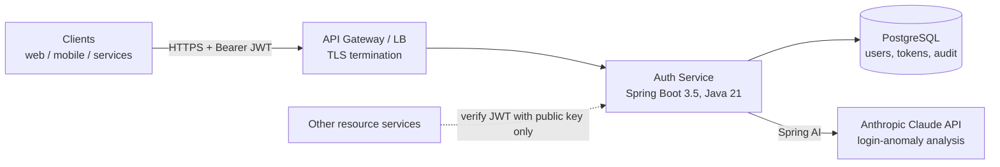
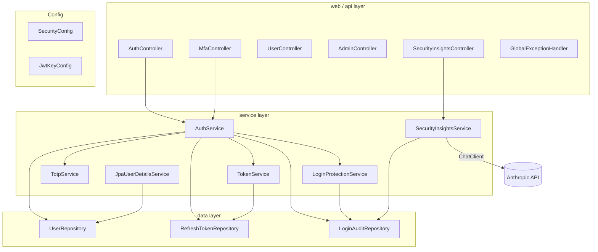
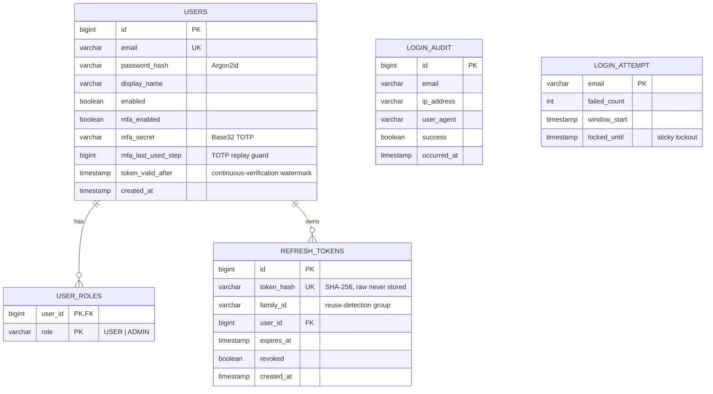
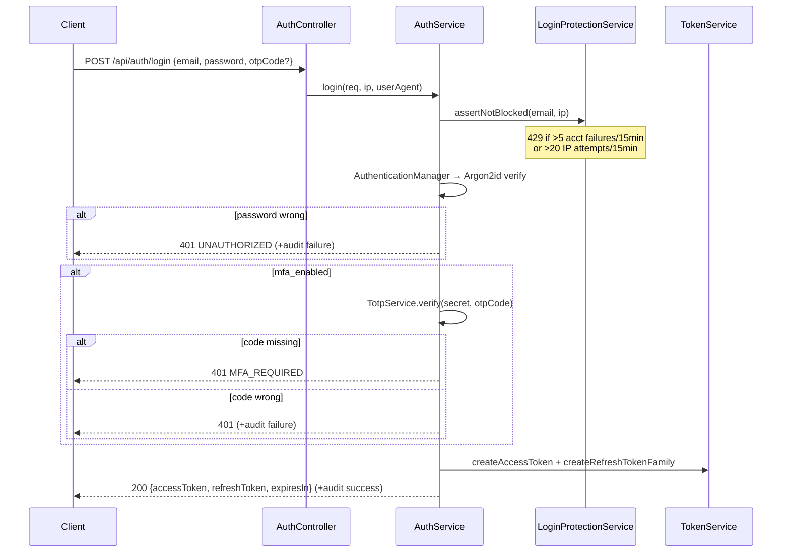
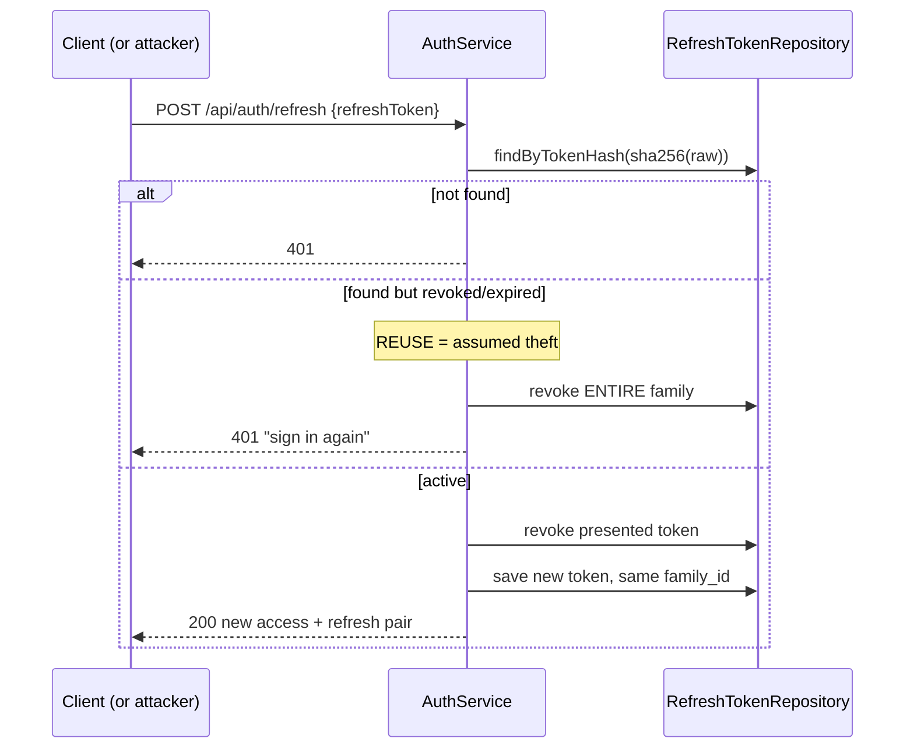

# Auth Service — Zero-Trust Edition

Authentication & authorization service built on the modern Java stack around zero-trust principles: **never trust, always verify; deny by default; least privilege; assume breach.**

- Java 21 (virtual threads) · Spring Boot 3.5 · Spring Security 6 · Gradle (Groovy DSL)
- RS256 JWT with **continuous verification** (per-request revocation) + rotating refresh-token families · Argon2id · TOTP MFA · **risk-based step-up** · Flyway · PostgreSQL/H2
- **Standards OAuth2.1 / OIDC provider** (Spring Authorization Server): discovery, JWKS, `authorization_code`+PKCE, `client_credentials`, refresh, userinfo — any resource server validates tokens via JWKS (see [§6](#6-oauth2--oidc-provider))
- Spring AI 1.0 (OpenAI / Anthropic) for AI-assisted login-anomaly analysis
- Ships with a **React console** ([`../auth-ui`](../auth-ui)) and a **Kubernetes deployment** (2-node, Traefik TLS ingress, multi-replica HA, Postgres) — see [§5](#5-kubernetes-deployment)

> 📄 **Full design document (HLD + LLD, current):** [`docs/DESIGN.pdf`](docs/DESIGN.pdf)

---

# 1. High-Level Design (HLD)

## 1.1 System context



Key property: the service is **stateless**. Any instance can serve any request; other microservices can verify access tokens with just the RSA **public** key — only this service holds the private signing key.

## 1.2 Architectural decisions

| Decision | Choice | Rationale |
|---|---|---|
| Session model | Stateless JWT | Horizontal scaling, no session store, zero-trust re-verification per request |
| Signing | RS256 (asymmetric) | Verifiers can't forge tokens (unlike HS256) |
| Access-token TTL | 10 min | Small compromise window |
| Refresh tokens | Opaque + hashed + rotated, family-based | Revocable, replay-resistant, theft-detecting |
| Password hashing | Argon2id | OWASP first choice, memory-hard |
| MFA | TOTP (RFC 6238) | Standard authenticator apps, no SMS cost/risk, zero extra deps |
| AuthZ model | RBAC over fine-grained permissions | Least privilege; roles are just permission bundles |
| Default posture | `anyRequest().denyAll()` | Unlisted endpoints don't exist |
| Concurrency | Virtual threads | Thread-per-request simplicity at async scale |
| Schema | Flyway versioned migrations | Reproducible, reviewable DB changes |

## 1.3 Zero-trust control map

| Zero-trust principle | Implementation |
|---|---|
| Verify explicitly, every request | Signature + expiry + issuer + audience **+ live user state** checked per call |
| Continuous verification | `TokenRevocationValidator` re-checks the user on every request; logout / disable / MFA-activate invalidate live access tokens immediately (per-user `token_valid_after` watermark) |
| Least privilege | Permission-level `@PreAuthorize` (`users:manage`, `security:insights`, …) |
| Deny by default | Filter chain terminates in `denyAll()`; `/actuator/**` requires auth except `/health` |
| Short-lived credentials | 10-min access tokens, 7-day rotating refresh tokens |
| Assume breach | Refresh-token reuse ⇒ whole family revoked |
| Strong + adaptive identity | Argon2id + optional TOTP; **risk-based step-up** forces MFA on suspicious logins |
| Attack throttling | Per-account lockout (DB, race-free) + per-IP rate limit |
| Encrypt in transit | TLS terminated at the ingress (HSTS emitted) |
| Continuous monitoring | Full auth audit trail + AI (gpt-4o/Claude) risk analysis |

## 1.4 Component view



---

# 2. Low-Level Design (LLD)

## 2.1 Data model (ER)



`LOGIN_AUDIT` is intentionally unlinked to `USERS` so failed attempts against non-existent accounts are also recorded. `LOGIN_ATTEMPT` is the authoritative, race-free lockout counter (updated under a pessimistic write lock). Schema is built by Flyway migrations **V1–V5** (V3 = TOTP replay guard, V4 = lockout counter, V5 = revocation watermark).

## 2.2 Authorization model

```
Role  ──contains──►  Permissions
USER   : profile:read
ADMIN  : profile:read, users:read, users:manage, security:insights
```

At login, `TokenService` flattens roles → `authorities` claim: `["ROLE_ADMIN","profile:read","users:manage",...]`. `SecurityConfig` maps the claim straight to Spring authorities (no prefix). Enforcement is two-layer: URL rules (coarse) + `@PreAuthorize` per method (fine).

## 2.3 Access-token contract

```json
{
  "iss": "auth-service",
  "aud": ["auth-service-api"],
  "sub": "alice@example.com",
  "jti": "3f2c…-uuid",
  "uid": 1,
  "authorities": ["ROLE_USER", "profile:read"],
  "iat": 1751600000,
  "exp": 1751600600
}
```
Decoder rejects any token failing **signature, expiry, issuer, audience, or continuous verification** — the last being a per-request `TokenRevocationValidator` that rejects tokens for disabled/deleted users or any token issued before the user's `token_valid_after` watermark (bumped on logout, disable, and MFA activation). This makes access tokens **revocable mid-life**, not just at expiry.

## 2.4 Sequence — login with MFA



## 2.5 Sequence — refresh rotation & theft detection



## 2.6 Class responsibilities

| Class | Responsibility | Key details |
|---|---|---|
| `SecurityConfig` | Filter chain, deny-by-default, authority mapping, headers | HSTS, CSP; `authorities` claim → `GrantedAuthority` |
| `JwtKeyConfig` | RSA key material + strict decoder | PEM-configured or ephemeral dev keys; issuer+audience validators |
| `SecurityProperties` | Typed config (`app.security.*`) | TTLs, PEM locations |
| `AuthService` | Orchestrates register / login / refresh / logout / MFA lifecycle | Transactional; audit on every attempt |
| `TokenService` | Access-token minting; refresh families | 48-byte SecureRandom refresh, SHA-256 at rest, `jti` per token |
| `TotpService` | RFC 6238 on plain JDK | HmacSHA1, 6 digits/30s, ±1 window, constant-time compare, Base32 codec |
| `LoginProtectionService` | Lockout + IP throttle | Account: audit-derived (multi-instance safe); IP: in-memory window |
| `JpaUserDetailsService` | Bridges users table to Spring Security | Used only at password-check time |
| `SecurityInsightsService` | AI anomaly analysis | Claude via Spring AI; rule-based fallback when `AI_ENABLED=false` |
| `GlobalExceptionHandler` | Errors → stable JSON codes | `MFA_REQUIRED`, `RATE_LIMITED`, `EMAIL_TAKEN`, … |

## 2.7 API surface

| Method | Path | Access | Notes |
|---|---|---|---|
| POST | `/api/auth/register` | public | 12-char min password |
| POST | `/api/auth/login` | public | optional `otpCode`; may return `MFA_REQUIRED` or `STEP_UP_REQUIRED` |
| POST | `/api/auth/refresh` | public | rotation + reuse detection |
| POST | `/api/auth/logout` | authenticated | revokes refresh tokens **+ invalidates live access tokens** |
| GET | `/api/users/me` | `profile:read` | |
| POST | `/api/users/me/mfa/setup` | `profile:read` | returns secret + `otpauth://` URI |
| POST | `/api/users/me/mfa/activate` | `profile:read` | confirms 6-digit code |
| GET | `/api/admin/users` | `users:read` | paged |
| PATCH | `/api/admin/users/{id}/disable` | `users:manage` | |
| GET | `/api/admin/security/insights?email=…` | `security:insights` | AI risk analysis |

Swagger UI: `http://localhost:8080/swagger-ui.html`

## 2.8 Error contract

`{"code": "...", "message": "...", "timestamp": "..."}` with codes: `UNAUTHORIZED` (401), `MFA_REQUIRED` (401), `STEP_UP_REQUIRED` (403), `RATE_LIMITED` (429), `EMAIL_TAKEN` / `CONFLICT` / `MFA_ALREADY_ENABLED` (409), `VALIDATION_FAILED` / `MALFORMED_REQUEST` (400), `NOT_FOUND` (404).

## 2.9 Logging & observability

Three log channels, all correlation-tagged:

| Channel | Logger | What it carries |
|---|---|---|
| Access log | `http.access` | one line per request: method, path, status, latency |
| Security events | `security.events` | `login_success`, `login_failed`, `login_mfa_challenge`, `account_locked`, `ip_throttled`, `refresh_token_reuse`, `mfa_activated`, `logout_all`, `user_registered` — greppable `event=` key/value format, ideal for alerting rules |
| Application | per-class loggers | startup warnings (ephemeral keys), AI analysis runs, errors |

Mechanics:

- **Correlation IDs** — `RequestLoggingFilter` assigns (or propagates) an `X-Request-Id`, stores it in the SLF4J MDC so *every* line logged during that request carries it, and echoes it in the response header.
- **Environment-aware format** (`logback-spring.xml`): dev profile → readable console with the requestId; prod profile → one-line **JSON** via logstash-logback-encoder, ready for ELK / Loki / CloudWatch, with `service=auth-service` stamped on every record.
- **PII discipline** — passwords, OTP codes, token values, and query strings are never logged; security events carry emails/IPs only where operationally necessary, and the DB `login_audit` table remains the authoritative forensic record.
- Health-check requests are excluded from access logs to avoid noise.

Alerting suggestions: page on `refresh_token_reuse` (proven theft), alert on rate spikes of `account_locked` / `ip_throttled` (attack in progress).

---

# 3. Running it

**Profiles:** `local` (default) = in-memory **H2** + H2 console, ephemeral RSA keys — zero setup for a laptop. `dev` = **PostgreSQL** (`DB_URL` / `DB_USER` / `DB_PASSWORD`) with a persistent RSA key — the deployed/shared environment.

## Option A — local JDK

Requires JDK 21 and Gradle 8.7+ (or `./gradlew` once).

```bash
./gradlew bootRun     # local profile: in-memory H2, ephemeral RSA keys
./gradlew test        # full suite incl. attack-path tests (see 3.1)
```

## Option B — Docker (Postgres via the `dev` profile)

```bash
DB_PASSWORD=change-me docker compose up --build
```

Multi-stage Dockerfile (Gradle build stage → slim JRE runtime, **non-root user**, container-aware heap). Compose brings up PostgreSQL 16 with a healthcheck-gated start and runs Flyway migrations on boot.

## Option C — Kubernetes

See [§5](#5-kubernetes-deployment) for the full 2-node cluster deployment (Traefik TLS ingress, multi-replica HA, Postgres, AI insights).

## 3.1 Test suite (attack paths)

| Test class | Proves |
|---|---|
| `AuthFlowTest` | register → login happy path; anonymous rejected; wrong password rejected |
| `RefreshTokenRotationTest` | rotation works; **replaying a used token revokes the whole family** |
| `AccountLockoutTest` | 5 failures lock the account — even the correct password then gets `429` |
| `MfaFlowTest` | setup → activate → password-only rejected (`MFA_REQUIRED`) → wrong code rejected → valid TOTP accepted |
| `AuthorizationMatrixTest` | least privilege (USER blocked from admin/permission endpoints) and **deny-by-default** (unlisted URLs 401/403) |

## 3.2 Metrics (Prometheus)

`/actuator/prometheus` (firewall it in production) exposes, among the standard JVM/HTTP metrics:

| Metric | Alert idea |
|---|---|
| `auth_login_success_total` / `auth_login_failure_total{reason}` | alert on failure-rate spike (credential stuffing) |
| `auth_account_lockout_total` | alert on burst |
| `auth_ip_throttled_total` | alert on burst |
| `auth_refresh_token_reuse_total` | **page immediately** — proven token theft |
| `auth_mfa_activation_total` | adoption dashboard |
| `auth_ai_insight_duration` | AI latency SLO |

```bash
# register + login
curl -s -X POST localhost:8080/api/auth/register -H 'Content-Type: application/json' \
  -d '{"email":"alice@example.com","password":"correct-horse-battery","displayName":"Alice"}'
curl -s -X POST localhost:8080/api/auth/login -H 'Content-Type: application/json' \
  -d '{"email":"alice@example.com","password":"correct-horse-battery"}'

# enable MFA (accessToken from login)
curl -s -X POST localhost:8080/api/users/me/mfa/setup -H "Authorization: Bearer $TOKEN"
curl -s -X POST localhost:8080/api/users/me/mfa/activate -H "Authorization: Bearer $TOKEN" \
  -H 'Content-Type: application/json' -d '{"code":"123456"}'
```

## AI security analyst — pluggable provider

The AI layer is provider-agnostic: `SecurityInsightsService` talks to Spring AI's
`ChatClient`, so switching LLM vendors is pure configuration. Both the Anthropic
and OpenAI starters are on the classpath; `spring.ai.model.chat` decides which
one is auto-configured (no bean conflicts).

```bash
# Anthropic Claude (default)
export ANTHROPIC_API_KEY=sk-ant-...     # get one at https://console.anthropic.com
export AI_ENABLED=true
gradle bootRun

# or OpenAI
export AI_PROVIDER=openai
export OPENAI_API_KEY=sk-...            # get one at https://platform.openai.com
export AI_ENABLED=true
gradle bootRun
```

**No API keys are committed to this repository — by design.** Keys are secrets
bound to your billing account; supply them via environment variables or a
secret manager (Vault, AWS Secrets Manager). Without a key, the insights
endpoint degrades to a rule-based heuristic.

Spring AI docs: https://docs.spring.io/spring-ai/reference/ · Anthropic API: https://docs.claude.com/en/api/overview

# 4. Production readiness

**Done** — continuous verification, adaptive step-up, refresh rotation/reuse detection, Argon2id, MFA + replay guard, least privilege, deny-by-default; **persistent shared RSA signing key** (→ multi-replica, restart-safe tokens); **PostgreSQL** persistence; **TLS** at the ingress; actuator locked down.

**Remaining (ranked)** — see `docs/DESIGN.pdf` §5 for detail:

1. **Postgres HA + backups** — single instance today; needs an operator (CloudNativePG) or managed DB + PITR (data-loss risk).
2. **Zero-downtime deploys** — add a PodDisruptionBudget + surge/unavailable tuning.
3. **Distributed rate limiting** — swap the in-memory per-IP throttle for Redis/Bucket4j (it's per-pod).
4. **Ops** — CI/CD, image scanning + signing, secrets manager (Vault/sealed-secrets), Prometheus/Grafana/log/trace stack.
5. **Real TLS** — cert-manager + a real CA (currently self-signed).
6. **Deferred by environment** — device mTLS (service mesh); enforced NetworkPolicies (needs a Calico-based cluster; k3s flannel doesn't enforce).

**Bootstrap admin** (no self-service admin by design): `INSERT INTO user_roles (user_id, role) VALUES (1, 'ADMIN');` then re-login.

---

# 5. Kubernetes deployment

A complete deployment runs on a 2-node k3d/k3s cluster. Manifests live outside the repo build (`kubernetes_cluster/manifests/{auth-stack,postgres}.yaml`).

```
Browser ──HTTPS──▶ k3d LoadBalancer (:8081 http, :8443 https)
                        │
                        ▼
                 Traefik Ingress ──TLS (auth-tls)
                    │           │
              / ────┘           └──── /api
              ▼                       ▼
        auth-ui (nginx)        auth-service ×2  ──▶ PostgreSQL 16 (PVC)
        React SPA              RS256 · JWT           └ Flyway V1–V5
                               (shared signing key)
                                     └──▶ OpenAI gpt-4o (AI insights)
```

| Concern | How |
|---|---|
| Images | `auth-service` (staged jar → Temurin JRE, non-root), `auth-ui` (node build → nginx); `k3d image import` (no registry) |
| Profile | `SPRING_PROFILES_ACTIVE=dev` → Postgres; `DB_*` from the `postgres-creds` Secret |
| Ingress | Traefik: `/` → auth-ui, `/api` → auth-service; **TLS** via the `auth-tls` Secret |
| HA | `replicas: 2`, `podAntiAffinity` across nodes, **shared RS256 key** from the `jwt-signing-keys` Secret (tokens survive restarts) |
| Secrets | `jwt-signing-keys`, `postgres-creds`, `ai-keys`, `auth-tls` |
| AI | `AI_ENABLED=true`, key in the `ai-keys` Secret (live gpt-4o; rule-based fallback otherwise) |

**URLs:** `http://localhost:8081/` · `https://localhost:8443/` (self-signed). The React console lives in [`../auth-ui`](../auth-ui) (own README).

---

# 6. OAuth2 / OIDC provider

The service is a **standards-compliant OAuth2.1 / OpenID Connect provider** (Spring Authorization Server), so it plugs into any OIDC-aware client or resource server — no shared secret, no custom integration. It reuses the same RSA key and JPA user store as the custom `/api/auth` endpoints, under a **unified issuer** (`app.security.issuer` / `AUTH_ISSUER`).

## Endpoints (from OIDC discovery)

| Purpose | Path |
|---|---|
| Discovery | `/.well-known/openid-configuration` |
| JWKS (public keys) | `/oauth2/jwks` |
| Authorization | `/oauth2/authorize` (authorization_code + **PKCE**) |
| Token | `/oauth2/token` (authorization_code, client_credentials, refresh_token) |
| UserInfo | `/userinfo` |
| Login (for the interactive flow) | `/oauth2/login` |

## Registered clients

| Client | Type | Grants | Notes |
|---|---|---|---|
| `auth-ui` | public (PKCE, no secret) | `authorization_code`, `refresh_token` | scopes `openid profile`; redirect `…/callback` |
| `service-account` | confidential | `client_credentials` | secret from the `oidc-client` Secret (`app.oidc.service-client-secret`) |

## Integrate a resource server

Point any service at the issuer — it fetches the JWKS itself:

```yaml
spring:
  security:
    oauth2:
      resourceserver:
        jwt:
          issuer-uri: https://localhost:8443
```

## Quick checks

```bash
# discovery + JWKS (public)
curl -sk https://localhost:8443/.well-known/openid-configuration
curl -sk https://localhost:8443/oauth2/jwks

# machine-to-machine token
curl -sk -u service-account:<secret> \
  -d 'grant_type=client_credentials&scope=api.read' \
  https://localhost:8443/oauth2/token
```

The interactive `authorization_code`+PKCE flow issues an **ID token** + access token and serves UserInfo (verified end-to-end).

**Coexistence & limits:** the custom `/api/auth` tokens and the OIDC tokens share one issuer and key; continuous verification applies only to the custom (`uid`-bearing) tokens. The OIDC interactive login is currently **password-only** — MFA / lockout / step-up (in the `/api/auth` pipeline) aren't yet enforced on it (tracked follow-up: an MFA-aware authentication flow).
